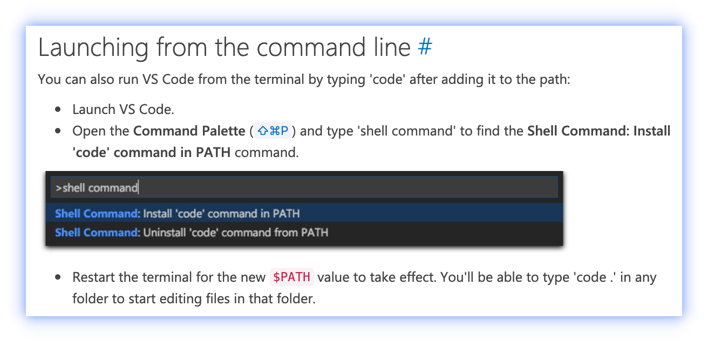

### cm-react-inspector

------

cm-react-inspector是一款build-script的插件,适合在基于build-script的项目中使用(如使用ice.js构建的项目)。用于在本地调试时，快速定位页面上的组件所在的源码的位置。


本项目的开发基于:

[react-dev-inspector](https://github.com/zthxxx/react-dev-inspector)

[build-plugin-dev-inspector](https://ice.alibaba-inc.com/docs/guide/develop/plugin-list#build-plugin-dev-inspector)

如果需要在基于其他构建工具(umi、create-react-app等)的项目中使用,请使用
[react-dev-inspector](https://github.com/zthxxx/react-dev-inspector)

### 使用方式

1.安装

```
npm i --save-dev cm-react-inspector
```

2.在 `build.json` 中引入插件

```json
{
  "plugins": [
    "cm-react-inspector"
  ]
}
```

3.Add Inspector React Component

```javascript
import React from 'react'
import { Inspector, InspectParams } from 'react-dev-inspector'

const InspectorWrapper = process.env.NODE_ENV === 'development'
  ? Inspector
  : React.Fragment

export const Layout = () => {
  // ...

  return (
    <InspectorWrapper
      // props docs see:
      // https://github.com/zthxxx/react-dev-inspector#inspector-component-props
      keys={['shift', 'command', 'o']}
      disableLaunchEditor={false}
      onHoverElement={(params: InspectParams) => {}}
      onClickElement={(params: InspectParams) => {}}
    >
     <YourComponent>
       ...
     </YourComponent>
    </InspectorWrapper>
  )
}

```

### IDE / Editor config

#### VSCode

- install VSCode command line tools, [see the official docs](https://code.visualstudio.com/docs/setup/mac#_launching-from-the-command-line)
  

- set env to shell, like `.bashrc` or `.zshrc`
  ```bash
  export REACT_EDITOR=code
  ```


